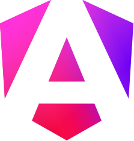

# Da hora ter você por aqui!

Quer contribuir com código? Nice 🤘

Aqui vão alguns passos pra executar o projeto em desenvolvimento.

## Requisitos

1. [node.js](https://nodejs.org/pt/download) v20+
1. [pnpm](https://pnpm.io/installation) instalado
1. [docker](https://docs.docker.com/engine/install) instalado

## Clone o projeto

```sh
git clone https://github.com/DeveloperParana/devmx
```

## Variáveis de ambiente

Configure a senha do banco e segredo jwt como quiser para uso local.

Para isso, renomeie o arquivo [`.env-example`](./.env-example) para `.env`

```sh
mv .env-example .env
```

## Docker

Essas variáveis são usadas no arquivo [docker-compose.yml](./docker-compose.yml).

> [!IMPORTANT]
> Primeiro preencha os valores para `DB_USER`, `DB_PASS`, `JWT_SECRET` no arquivo [.env](./.env), salve e só depois disso execute o docker.

```sh
docker compose up -d
```

## Instalação

Instale as dependências do projeto

```sh
pnpm install
```

## Execução

Execute o back-end para criar as collections no banco

```sh
pnpm dev:server
```

Assim que conluir, você já pode finalizar o processo (`Ctrl` + `C` / `Cmd` + `C`), pois você não quer criar dados úteis manualmente, certo?

## Seeds

Preparei alguns seeds pra você importar na base de dados, mas primeiro verifique se você tem o comando `mongoimport`, caso não tenha, acesse [este link](https://www.mongodb.com/pt-br/docs/database-tools/installation/installation/#installing-the-database-tools) para saber como instalar.

> [!NOTE]
> Ele é necessário apenas para importar dados iniciais não obrigatórios, como dados de login com permissões distintas e todas as cidades do brasil com latitude e longitude.

Para importar execute, não se esqueça de colocar seu usuário no `--username=seu-user` configurado no [`.env`](./.env). Ao executar, ele irá solicitar a senha que foi configurada no mesmo arquivo.

### Cidades

```sh
mongoimport --host=localhost --port=27017 --username= --authenticationDatabase=admin --db=devparana --collection=citycollections --file=assets/seeds/city-collection.json
```

### Usuários

```sh
mongoimport --host=localhost --port=27017 --username= --authenticationDatabase=admin --db=devparana --collection=accountcollections --file=assets/seeds/account-collection.json
```

Usuários que serão cadastrados

| username | password | member | speaker | donor | leader | staff | fellow | manager | director |
| -------- | -------- | :----: | :-----: | :---: | :----: | :---: | :----: | :-----: | :------: |
| member   | member   |   ✓    |    𝘅    |   𝘅   |   𝘅    |   𝘅   |   𝘅    |    𝘅    |    𝘅     |
| speaker  | speaker  |   ✓    |    ✓    |   𝘅   |   𝘅    |   𝘅   |   𝘅    |    𝘅    |    𝘅     |
| donor    | donor123 |   ✓    |    𝘅    |   ✓   |   𝘅    |   𝘅   |   𝘅    |    𝘅    |    𝘅     |
| leader   | leader   |   ✓    |    𝘅    |   𝘅   |   ✓    |   𝘅   |   𝘅    |    𝘅    |    𝘅     |
| staff    | staff123 |   ✓    |    𝘅    |   𝘅   |   𝘅    |   ✓   |   𝘅    |    𝘅    |    𝘅     |
| fellow   | fellow   |   ✓    |    𝘅    |   𝘅   |   𝘅    |   𝘅   |   ✓    |    𝘅    |    𝘅     |
| manager  | manager  |   ✓    |    𝘅    |   𝘅   |   𝘅    |   𝘅   |   𝘅    |    ✓    |    𝘅     |
| director | director |   ✓    |    𝘅    |   𝘅   |   𝘅    |   𝘅   |   𝘅    |    𝘅    |    ✓     |

## Agora sim!

Agora tudo está configurado pra você executar em desenvolvimento, configurei a execução do back-end e front-end no mesmo comando a seguir.

```sh
pnpm dev
```

## Convenção usada em commits

Apesar de atualmente não haver intenção de automatizações para publicação de pacotes, os [commits convencionais](https://conventionalcommits.org/pt-br/v1.0.0) se mostraram um bom caminho a ser seguido.

> [!TIP]
> Use o comando `pnpm commit`, e apenas responda as perguntas, assim seu commit seguirá a convenção utilizada.

Os commits podem ser feitos em português, mas use inglês para termos técnicos, não tente traduzi-los quando eles são conhecidos e usados em inglês, por gentileza.

> [!WARNING]
> Antes de escrever seu commit, execute o comando `pnpm affected` para verificar quaisquer possíveis problemas de `lint`, `test` e `build` nos projetos afetados pelas alterações.


---


## Stack

<section style="display: flex">

<figure style="display: inline-flex; flex-direction: column">



  <figcaption style="text-align: center">
  
  [Angular](https://angular.dev)
  
  </figcaption>

</figure>

<figure style="display: inline-flex; flex-direction: column">


  <figcaption style="text-align: center">
  
  [NestJS](https://docs.nestjs.com)
  
  </figcaption>

</figure>

<figure style="display: inline-flex; flex-direction: column">


  <figcaption style="text-align: center">
  
  [Nx Dev](https://nx.dev)
  
  </figcaption>

</figure>

</section>


## Arquitetura

Trata-se de responsabilidade e relacionamentos, ou seja, qual a responsabilidade de cada camada e quais camadas podem depender diretamente uma das outras. Esta é uma convenção chamada [enforce module boundaries](https://nx.dev/features/enforce-module-boundaries#enforce-module-boundaries) e quem permite que as regras sejam aplicadas é o [nx](https://nx.dev).

### Responsabilidades e relacionamentos entre tipos de bibliotecas

A tabela a seguir representa a configuração no arquivo [`.eslintrc.json`](.eslintrc.json).

|            | api | util | domain | data | ui  | feature | resource | app |
| ---------: | :-: | :--: | :----: | :--: | :-: | :-----: | :------: | :-: |
|      `api` |  ✓  |  𝘅   |   𝘅    |  𝘅   |  𝘅  |    𝘅    |    𝘅     |  𝘅  |
|     `util` |  ✓  |  ✓   |   𝘅    |  𝘅   |  𝘅  |    𝘅    |    𝘅     |  𝘅  |
|   `domain` |  ✓  |  ✓   |   ✓    |  𝘅   |  𝘅  |    𝘅    |    𝘅     |  𝘅  |
|     `data` |  ✓  |  ✓   |   ✓    |  ✓   |  𝘅  |    𝘅    |    𝘅     |  𝘅  |
|       `ui` |  ✓  |  ✓   |   𝘅    |  𝘅   |  ✓  |    𝘅    |    𝘅     |  𝘅  |
|  `feature` |  ✓  |  ✓   |   𝘅    |  ✓   |  ✓  |    ✓    |    𝘅     |  𝘅  |
| `resource` |  ✓  |  ✓   |   𝘅    |  ✓   |  𝘅  |    𝘅    |    ✓     |  𝘅  |
|      `app` |  ✓  |  ✓   |   𝘅    |  ✓   |  ✓  |    ✓    |    ✓     |  𝘅  |

Caso tenha interesse em aprofundar neste assunto e descobrir os motivos, recomendo que leia um conteúdo que escrevi ano passado, você pode fazer download através do link [Arquitetura em camadas, uma abordagem sobre responsabilidades e relacionamentos](https://conteudode.dev/pdf/nx).

---

```
                                       ..........
                                     ..............
                                   ..................
                                ........................
                              ............................
                            ................................
                          ....................................
                        ........................................
                      ..................       ...................
                   ............   .....  ......  ....................
                 ............  ...  ...  ......  ......................
               ..............  ....  ...        ....       ..............
             ........   .....       .....      .....  ....  ...............
           ........       ......  .......      .....   .   ....     .........
         .........  ....  ......  .......      .......    ....  ...   .........
      .............       ......     ....      ........  .....  ...   ............
     ................   ...........            ........  ......     ...............
     ................   .................      .....    ........   ................
     ................    ................              .........   ................
     .................     ..............        ...............   ................
      ..................             ....      .................   ...............
         ....................                  .................   ............
           ...........................         ...............    ...........
             ............................      .......           ..........
               ..........................      .             ............
                 ........................          ....................
                   ......................      ......................
                      ...................      ...................
                        .................      .................
                          ...............      ...............
                            .............      .............
                              ...........      ...........
                                :........      .........
                                   ......      ......
                                     ....      ....
                                       ..      ..
```
