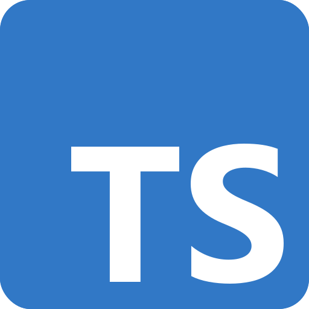

## Ambiente

Passos necessários pra execução do projeto no seu ambiente de desenvolvimento.

### Projeto

```sh
git clone https://github.com/DeveloperParana/devmx
```

### Requisitos

1. [node.js](https://nodejs.org/pt/download) v22+
1. [pnpm](https://pnpm.io/installation) v8.14
1. [docker](https://docs.docker.com/engine/install)

> [!TIP]
> Se você já tem o Node.js instalado, mas não na versão 22, considere usar o [NVM](https://github.com/nvm-sh/nvm). Ele permite gerenciar múltiplas versões do Node.js, o que é útil para projetos diferentes que requerem versões distintas. Isso pode evitar problemas futuros em outros projetos que utilizem versões diferentes do Node.js.

#### Uso do NVM

O NVM (Node Version Manager) permite gerenciar múltiplas versões do Node.js no mesmo ambiente de desenvolvimento. Isso é especialmente útil quando você trabalha em diferentes projetos que requerem versões distintas do Node.js.
Para mais informações, consulte a [documentação oficial do NVM](https://github.com/nvm-sh/nvm).

---

Para preparar o ambiente execute:

```sh
./tools/scripts/setup.sh
```

Caso tenha dado tudo certo e você esteja com node e pnpm instalado com docker executado, está tudo pronto!

Para começar execute:

```sh
pnpm dev
```


---

### Docker

Garanta que o arquivo `.env` está preenchido com as variáveis corretamente

> [!IMPORTANT]
> Garanta que o arquivo `.env` está preenchido com as variáveis corretamente, as mais importantes e causadoras de erros são `DB_USER`, `DB_PASS` e `JWT_SECRET`.

Para executar o mongodb com docker: `docker compose up -d`


### Tecnologiass


**TypeScript**

**Angular Framework**

**Nest Framework**

**Nx Dev Tools**

<div style="width: 100%; display: flex; justify-content: space-between">




</div>
